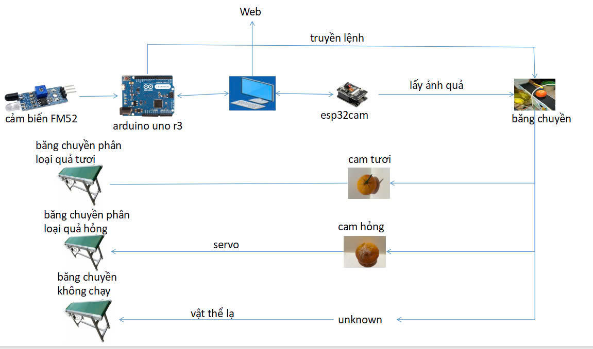
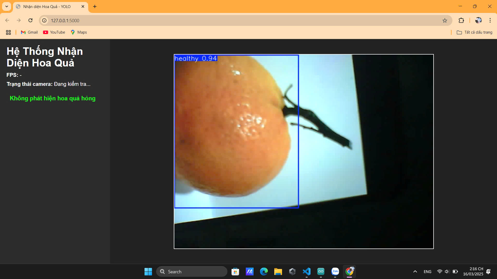
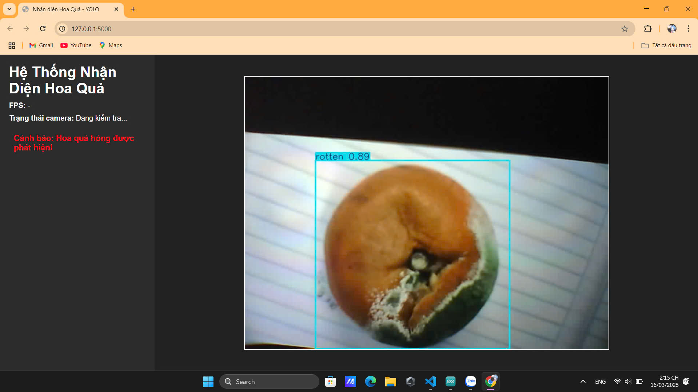

<!-- REDMI.md - File hướng dẫn và thông tin dự án --

<!-- Header: Logo -->

  
  

<!-- Navigation Buttons -->

  <a href="https://www.facebook.com/DNUAIoTLab" style="display: inline-block; padding: 10px 20px; background-color: #28a745; color: #fff; border-radius: 5px; text-decoration: none; margin: 0 5px;">Made by AIoTLab</a>
  <a href="https://fitdnu.net/" style="display: inline-block; padding: 10px 20px; background-color: #dc3545; color: #fff; border-radius: 5px; text-decoration: none; margin: 0 5px;">Fit DNU</a>
  <a href="https://dainam.edu.vn/vi" style="display: inline-block; padding: 10px 20px; background-color: #ffc107; color: #333; border-radius: 5px; text-decoration: none; margin: 0 5px;">DaiNam University</a>

<!-- Project Description -->
<h2 style="text-align: center;">✨ Mô tả dự án</h2>

  Dự án này sử dụng <strong>YOLO</strong> để phân loại hoa quả (tươi/hỏng) từ hình ảnh được chụp từ <strong>ESP32-CAM</strong>. Hệ thống dùng <strong>Flask</strong> làm backend để xử lý ảnh và gửi dữ liệu về giao diện web, đồng thời kết nối với <strong>Arduino</strong> để điều khiển phần cứng.

<!-- Project Structure -->
<h2 style="text-align: center;">🚀 Cấu trúc dự án</h2>
<pre style="background-color: rgb(0, 0, 0); padding: 15px; border-radius: 5px; overflow-x: auto; max-width: 800px; margin: auto; color: #fff;">
📂 Nghien_cuu_phan_loai_HQ
├── 📸 anhcam/                   # Thư mục lưu trữ hình ảnh từ camera
├── 🔌 PhanCung/                  
│   ├── ⚙️ BTL.ino               # Arduino code cho phần cứng
│   └── 📡 CameraWebServer.ino   # Arduino code cho Camera Web Server
├── 💻 REDMI/                    # Thư mục chứa code liên quan đến REDMI
├── 🎨 static/                   # Tài nguyên tĩnh (CSS, JS, hình ảnh, …)
│   └── 📄 .gitkeep             # File giữ chỗ cho thư mục rỗng
├── 🌐 templates/                # Giao diện HTML cho Flask
│   └── 🖥️ index.html           # Giao diện trang web
├── 🤖 best.pt                   # File mô hình YOLO đã huấn luyện
├── 📦 requirements.txt          # Danh sách các thư viện Python cần cài đặt
└── 🐍 web.py                    # Flask server và xử lý ảnh
</pre>

<!-- Hardware Section -->
## 🛠️ Phần cứng

- **ARDUINO UNO R3**
- **ESP32-CAM**
- **SERVO**
- **WIFI**
- **DÂY KẾT NỐI**
- **BĂNG TRUYỀN**
- **CẢM BIẾN FM52**

## 💻 Phần mềm

- **🐍 Python**
- **Flask (2.3.2)**
- **Ultralytics YOLO (8.0.0)**
- **OpenCV-Python (4.8.0.76)**
- **NumPy (1.24.3)**
- **PySerial (3.5)**
- **Arduino IDE**
- **Servo Library**
- **best.pt**
- **HTML/CSS**

<!-- Python Libraries -->
<h2 style="text-align: center;">📦 Các thư viện Python cần thiết</h2>

  <strong>Các gói cần cài đặt:</strong> 
  - Flask==2.3.2 
  - ultralytics==8.0.0 
  - opencv-python==4.8.0.76 
  - numpy==1.24.3 
  - pyserial==3.5  
  <strong>Lệnh cài thư viện:</strong> 
  - (Tùy chọn) Tạo môi trường ảo:  
  <code>python -m venv venv</code> 
  <code>source venv/bin/activate   # Linux/MacOS</code> 
  <code>venv\Scripts\activate      # Windows</code>  
  - Cài đặt các gói:  
  <code>pip install -r requirements.txt</code> 
  Hoặc cài đặt trực tiếp:  
  <code>pip install Flask==2.3.2 ultralytics==8.0.0 opencv-python==4.8.0.76 numpy==1.24.3 pyserial==3.5</code>  
  - <strong>Chạy Flask server:</strong>  
  <code>python web.py</code>

<!-- Circuit Diagram / Wiring -->
<h2 style="text-align: center;">🧮 Bảng mạch</h2>

  ⛓️‍💥 <strong>Hướng dẫn cắm dây:</strong>

<!-- Bảng: Cảm biến FM52 -->
<h4 style="text-align: center;">Cảm biến FM52</h4>
<table>
  <tr>
    <th>Thiết bị</th>
    <th>Chân</th>
    <th>Giá trị</th>
    <th>Ghi chú</th>
  </tr>
  <tr>
    <td>Cảm biến FM52</td>
    <td>VCC</td>
    <td>5V</td>
    <td>Cấp nguồn cho cảm biến</td>
  </tr>
  <tr>
    <td></td>
    <td>GND</td>
    <td>GND</td>
    <td>Nối đất</td>
  </tr>
  <tr>
    <td></td>
    <td>OUT</td>
    <td>D7</td>
    <td>Xuất tín hiệu phát hiện vật thể</td>
  </tr>
</table>

 

<!-- Bảng: Relay (Điều khiển băng chuyền) -->
<h4 style="text-align: center;">Relay (Điều khiển băng chuyền)</h4>
<table>
  <tr>
    <th>Thiết bị</th>
    <th>Chân</th>
    <th>Giá trị</th>
    <th>Ghi chú</th>
  </tr>
  <tr>
    <td>Relay (Điều khiển băng chuyền)</td>
    <td>VCC</td>
    <td>5V</td>
    <td>Cấp nguồn cho relay</td>
  </tr>
  <tr>
    <td></td>
    <td>GND</td>
    <td>GND</td>
    <td>Nối đất</td>
  </tr>
  <tr>
    <td></td>
    <td>IN</td>
    <td>D8</td>
    <td>Điều khiển relay đóng/ngắt băng chuyền</td>
  </tr>
  <tr>
    <td></td>
    <td>COM</td>
    <td>1 cực của nguồn băng chuyền</td>
    <td>Dòng điện vào relay</td>
  </tr>
  <tr>
    <td></td>
    <td>NO</td>
    <td>1 cực của động cơ băng chuyền</td>
    <td>Khi relay mở, băng chuyền chạy</td>
  </tr>
</table>

 

<!-- Bảng: Băng chuyền -->
<h4 style="text-align: center;">Băng chuyền</h4>
<table>
  <tr>
    <th>Thiết bị</th>
    <th>Chân</th>
    <th>Giá trị</th>
    <th>Ghi chú</th>
  </tr>
  <tr>
    <td>Băng chuyền</td>
    <td>+</td>
    <td>Nối với NO của relay</td>
    <td>Nhận điện khi relay mở</td>
  </tr>
  <tr>
    <td></td>
    <td>-</td>
    <td>GND</td>
    <td>Hoàn thành mạch</td>
  </tr>
</table>

 

<!-- Bảng: Servo -->
<h4 style="text-align: center;">Servo</h4>
<table>
  <tr>
    <th>Thiết bị</th>
    <th>Chân</th>
    <th>Giá trị</th>
    <th>Ghi chú</th>
  </tr>
  <tr>
    <td>Servo</td>
    <td>VCC</td>
    <td>5V</td>
    <td>Cấp nguồn cho servo</td>
  </tr>
  <tr>
    <td></td>
    <td>GND</td>
    <td>GND</td>
    <td>Nối đất</td>
  </tr>
  <tr>
    <td></td>
    <td>Signal</td>
    <td>D9</td>
    <td>Nhận tín hiệu điều khiển từ Arduino</td>
  </tr>
</table>

<!-- Setup and Run Instructions -->
<h2 style="text-align: center;">🚀 Hướng dẫn cài đặt và chạy</h2>

  <strong>1. Chuẩn bị phần cứng:</strong> 
  - Nạp mã Arduino: 
  &nbsp;&nbsp;&bull; Mở file <code>BTL.ino</code> bằng Arduino IDE. 
  &nbsp;&nbsp;&bull; Kết nối board Arduino với máy tính. 
  &nbsp;&nbsp;&bull; Nạp (upload) mã nguồn lên board. 
  &nbsp;&nbsp;&bull; Đảm bảo Arduino xuất hiện trên cổng COM. 
  - Nạp mã cho ESP32-CAM với file <code>CameraWebServer.ino</code>.  
  <strong>2. CÀI ĐẶT PHẦN MỀM:</strong> 
  <strong>2.1 Cài đặt Arduino IDE:</strong> 
  &nbsp;&nbsp;&bull; Tải Arduino IDE tại: <a href="https://www.arduino.cc/en/software" target="_blank">Arduino Software</a>. 
  &nbsp;&nbsp;&bull; Cài đặt Driver CH340 nếu dùng board Arduino clone.  
  <strong>2.2 Cài đặt thư viện cho Arduino:</strong> 
  &nbsp;&nbsp;&bull; Mở Arduino IDE → Library Manager (Ctrl + Shift + I), tìm và cài: <code>Servo.h</code> (Điều khiển servo)

<!-- System Operation -->
<h2 style="text-align: center;">Hoạt động của hệ thống</h2>

<strong>🔧Kiến trúc của hệ thống 🪛</strong>

  

  <strong>1️⃣ Khởi động hệ thống:</strong> 
  - Bật nguồn cho Arduino, ESP32-CAM và máy tính. 
  - Mở Serial Monitor (115200 baud) trên Arduino IDE để theo dõi hoạt động. 
  - Chạy Flask Server trên PC bằng lệnh: <code>python web.py</code>  
  <strong>Quy trình hoạt động:</strong> 
  - Server nhận ảnh từ ESP32-CAM và phân loại bằng YOLO. 
  - Khi phát hiện quả, kết quả được gửi qua cổng Serial đến Arduino. 
  - ESP32-CAM chụp ảnh và gửi về máy tính. 
  - Python với YOLO phân loại ảnh và gửi kết quả về Arduino: 
  &nbsp;&nbsp;&rarr; <strong>"cam tươi"</strong> → Băng chuyền chạy tiếp (4 giây). 
  &nbsp;&nbsp;&rarr; <strong>"cam hỏng"</strong> → Băng chuyền chạy 1.9 giây, sau đó servo gạt quả hỏng (quay 90° trong 2 giây rồi quay lại). 
  &nbsp;&nbsp;&rarr; <strong>"unknown"</strong> → Không kích hoạt phần cứng, chỉ in thông báo. 
  - Arduino nhận kết quả và điều khiển động cơ, servo theo từng loại quả.

<!-- Code Explanation -->
<h2 style="text-align: center;"> Giải thích code</h2>

  <strong>Arduino Code (arduino_code.ino):</strong> 
  - <em>Khởi tạo:</em> Khởi tạo Serial ở tốc độ 115200, cấu hình chân cho cảm biến, relay và servo. Servo được gắn tại chân 9 và khởi tạo về góc 0°. 
  - <em>Vòng lặp chính:</em> Đọc trạng thái của cảm biến. Khi cảm biến thay đổi trạng thái hoặc sau khoảng thời gian định kỳ, gửi lệnh "CHECK" và chờ phản hồi từ Python. 
  - <em>Xử lý kết quả:</em> 
  &nbsp;&nbsp;&rarr; Nếu nhận "cam tươi": Kích hoạt relay chạy trong 4 giây. 
  &nbsp;&nbsp;&rarr; Nếu nhận "cam hỏng": Kích hoạt relay chạy 1.9 giây, quay servo 90° trong 2 giây, sau đó quay lại 0°. 
  &nbsp;&nbsp;&rarr; Nếu không nhận phản hồi : In thông báo timeout. 
   &nbsp;&nbsp;&rarr; Nếu nhận vật thể không phải hoa quả cần nhận diện "uknown": không kích hoạt hoạt đông và in thông báo "No relevant object detected; skipping processing.".  
  <strong>Flask &amp; YOLO Code (web.py):</strong> 
  - <em>Khởi tạo:</em> Flask server khởi chạy tại <code>http://0.0.0.0:5000/</code> và tải mô hình YOLO từ file <code>best.pt</code>. 
  - <em>Xử lý ảnh:</em> Lấy ảnh từ ESP32-CAM qua URL, chạy YOLO để nhận diện đối tượng (quả cam tươi/hỏng), cập nhật ảnh annotate và kết quả phân loại. 
  - <em>Giao tiếp với Arduino:</em> Khi nhận lệnh "CHECK" qua Serial, Flask sẽ chụp ảnh mới, xử lý và gửi kết quả ("cam tươi", "cam hỏng" hoặc "unknown") về Arduino. 
  - <em>Giao diện web:</em> Hiển thị video feed từ camera, thông tin FPS, trạng thái camera và cảnh báo.

<!-- Kết quả hiển thị -->
<h2 style="text-align: center;">📸 Kết quả hiển thị</h2>

  
<strong>Ảnh cam tươi trên web:</strong>

  
  
  
<strong>Ảnh cam hỏng được cảnh báo:</strong>

  

 

<h2 style="text-align: center;">🌟 Poster ✨</h2>

<strong>Poster nhóm </strong>

  

 

<!-- Đóng góp -->
<h2 style="text-align: center;">🤝 Đóng góp</h2>

Dự án được phát triển bởi 4 thành viên:

<table>
  <thead>
    <tr>
      <th>Họ và Tên</th>
      <th>Vai trò</th>
      <th>Profile</th>
    </tr>
  </thead>
  <tbody>
    <tr>
      <td>Đỗ Hải Anh</td>
      <td>Phát triển toàn bộ mã nguồn, tìm kiếm dữ liệu, lắp đặt phần cứng, train model, kiểm thử, triển khai dự án và thực hiện video giới thiệu, ngân sách thiết bị.</td>
      <td>
        <a href="https://www.facebook.com/profile.php?id=100090566726527&locale=vi_VN" style="display: inline-block; padding: 10px 20px; background-color: #6f42c1; color: #fff; border-radius: 5px; text-decoration: none;">Profile</a>
      </td>
    </tr>
    <tr>
      <td>Nguyễn Thu Huyền</td>
      <td>Biên soạn tài liệu overlef, hỗ trợ train model, thu thập dữ liệu, viết latext, làm poster, làm powpoint, thuyết trình, ngân sách thiết bị.</td>
      <td>
        <a href="https://www.facebook.com/share/1Fh5LW8kQw/?mibextid=wwXIfr" style="display: inline-block; padding: 10px 20px; background-color: #6f42c1; color: #fff; border-radius: 5px; text-decoration: none;">Profile</a>
      </td>
    </tr>
    <tr>
      <td>Nguyễn Phương Thảo</td>
      <td>Biên soạn tài liệu overlef, hỗ trợ train model, thu thập dữ liệu, viết latext, làm poster, làm powpoint, thuyết trình, ngân sách thiết bị.</td>
      <td>
        <a href="https://www.facebook.com/share/1EJTvJUZss/" style="display: inline-block; padding: 10px 20px; background-color: #6f42c1; color: #fff; border-radius: 5px; text-decoration: none;">Profile</a>
      </td>
    </tr>
    <tr>
      <td>Bùi Hải Phong</td>
      <td>Thu thập dữ liệu, gắn nhãn dữ liệu, hỗ trợ train model, lắp đặt phần cứng, kiểm thử, triển khai video giới thiệu, ngân sách thiết bị.</td>
      <td>
        <a href="https://www.facebook.com/dz.phong.378" style="display: inline-block; padding: 10px 20px; background-color: #6f42c1; color: #fff; border-radius: 5px; text-decoration: none;">Profile</a>
      </td>
    </tr>
  </tbody>
</table>

© 2025 NHÓM 1, CNTT16-06, TRƯỜNG ĐẠI HỌC ĐẠI NAM

